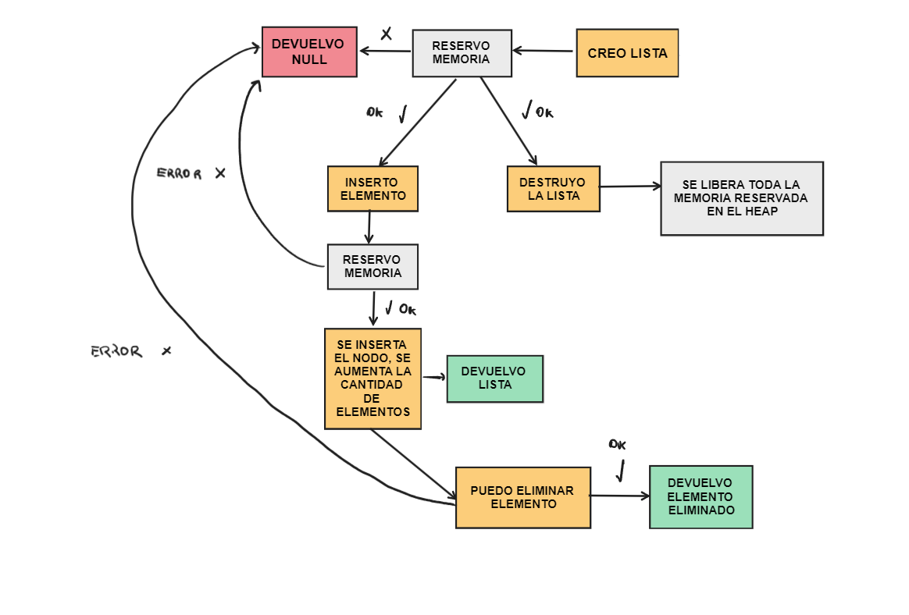
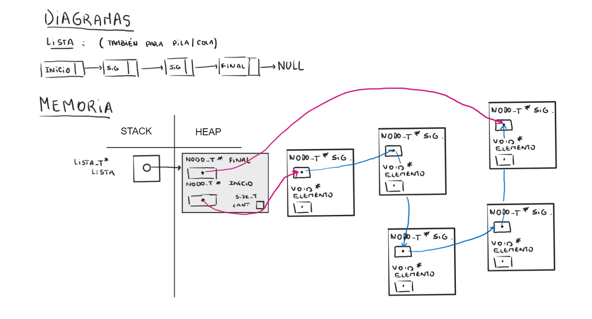
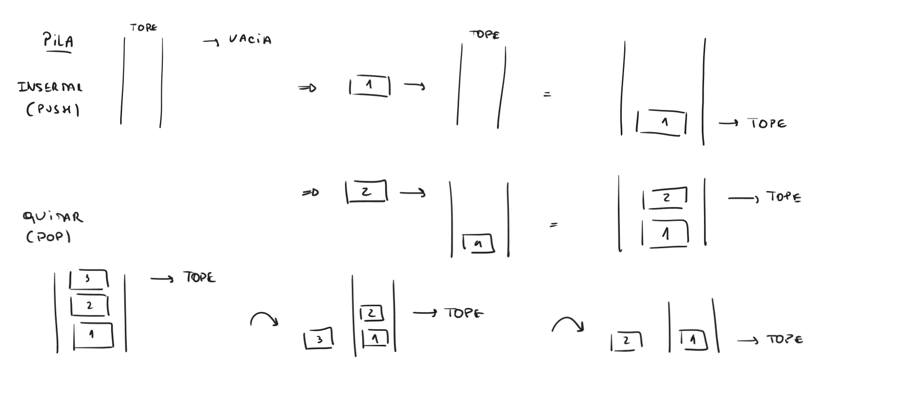
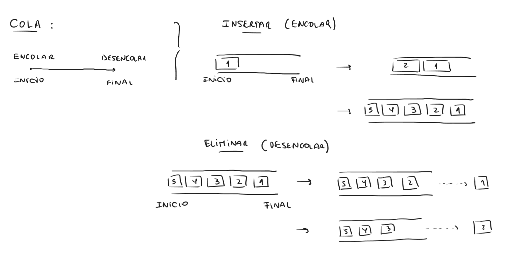

<div align="right">

</div>

# NOMBRE TP/TDA

## Repositorio de Cristian Portolan - 110596 - cportolan@fi.uba.ar

- Para compilar:

```bash
gcc -std=c99 -Wall -Wconversion -Wtype-limits -pedantic -Werror -O2 -g src/*.c pruebas_chanutron.o -o pruebas_chanutron
```

- Para ejecutar:

```bash
./pruebas_chanutron
```

- Para ejecutar con valgrind:
```bash
make valgrind-chanutron
```
---
##  Funcionamiento

Para este trabajo lo que tuvimos que realizar es una implementacion de un TDA Lista, y reutilizar su codigo para realizar otros TDA que son Pila y Cola.

El programa funciona dependiendo las funciones a las cuales queramos llamar. Principalmente, debemos crear una lista, con su funcion lista_crear. En esta funcion lo que se hace es reservar memoria en el heap de la cantidad de bytes de la estructura lista, se verifica que la memoria haya sido guardada correctamente, se inicializan los campos del struct y se devuelve la lista. 

```c
lista_t* lista = malloc(sizeof(lista_t));

if (!lista)
  return NULL;

lista->cantidad = 0;
lista->nodo_inicio = NULL;
lista->nodo_final = NULL;

	return lista;
```

Una vez creada, el usuario puede insertar y eliminar elementos al final o en cierta posicion de la lista, ademas se puede buscar un elemento, iterar dentro de la lista, y obviamente tenemos la funcion de destruir que se encarga de liberar toda la memoria que almacenamos para insertar en nuestra lista.

```c
lista_t *lista_insertar(lista_t *lista, void *elemento);
lista_t *lista_insertar_en_posicion(lista_t *lista, void *elemento, size_t posicion);
void *lista_quitar(lista_t *lista);
void *lista_quitar_de_posicion(lista_t *lista, size_t posicion);
```

Ademas, implementamos un iterador externo, que nos sirve para, tal cual su nombre, iterar en la lista. Este iterador tiene sus funciones de avanzar, verificar si se puede avanzar, y poder ver cual es el elemento que hay en la posicion actual. 

```c
struct lista_iterador {
	lista_t *lista;
	nodo_t *actual;
};
```

En esta imagen podemos ver el funcionamiento de nuestra lista para insertar o eliminar elementos.

<div align="center">

</div>

En esta siguiente imagen podemos observar el funcionamiento de como se reserva memoria para la lista y el trabajo de la misma, siendo una lista simplemente enlazada (implementada con nodos).

<div align="center">

</div>

---

## Respuestas a las preguntas teóricas

 - ¿Qué es una lista/pila/cola? Explicar con diagramas.

Una LISTA es un tipo de dato abstracto basado en los nodos enlazados, los cuales contienen un puntero a un nodo siguiente y un elemento, que puede ser de cualquier tipo de dato. Una LISTA tiene un nodo inicial y un nodo final, y se sabe que la lista termina cuando ultimo nodo tiene un puntero a NULL. Hay distintas implementaciones de LISTA, puede puede ser simple o doblemente enlazada y tambien se puede trabajar con un vector dinamico (utilizando realloc). 

A diferencia de lista, el TDA PILA es otro tipo de dato abstracto, similar a lista, pero que se trabaja siempre por un extremo, es decir, si se inserta un elemento se hace por el tope, y si se elimina tambien, podemos llevar el ejemplo a una pila de platos para lavar. En esta se pueden realizar operaciones como push/pop (insertar/eliminar), verificar si esta vacia y destruir la memoria reservada.

<div align="center">

</div>

Luego, el TDA COLA es similar a sus anteriores pero con la principal diferencia de que al insertar un elemento (encolar) se debe hacer por el final, y si se quiere eliminar un elemento (desencolar) se debe realizar por el inicio, para entenderlo mejor se puede llevar esto a la realidad y pensar en una cola para el supermercado.

<div align="center">

</div>

 - Explica y analiza las diferencias de complejidad entre las implementaciones de lista simplemente enlazada, doblemente enlazada y vector dinámico para las operaciones:
   - Insertar/obtener/eliminar al inicio
   - Insertar/obtener/eliminar al final
   - Insertar/obtener/eliminar al medio

LISTA SIMPLEMENTE ENLAZADA:

Para insertar, obtener y eliminar elementos ya sea al principio o al final, la complejidad es O(1) ya que tenemos un puntero al inicio y otro puntero al final de nuestra lista. Luego, para insertar/obtener/eliminar elementos de una posicion del medio, debemos recorrer nuestra lista, por lo tanto, al tener una iteracion decimos que la complejidad computacional es de O(n). En el caso de que no tengamos un puntero al final, todas las operaciones que son al final serian O(n) ya que se iteraria por toda la lista.

LISTA DOBLEMENTE ENLAZADA:

Para una lista doblemente enlazada, donde nuestros nodos ademas de tener un puntero al siguiente tienen un puntero al nodo anterior, podemos determinar que la complejidad es la misma que en la lista simplemente enlazada siempre y cuando nuestra implementacion tenga un puntero al final. En el caso contrario, las operaciones al final son de complejidad O(n) tal cual la simplemente enlazada.

VECTOR DINAMICO:

En un vector dinamico, teniendo un tope de elementos, la complejidad computacional de las operaciones que se realizan al final de la lista son de O(1) ya que podemos acceder facilmente a su posicion, luego, las que se realizan al inicio y en el medio, podemos determinar que son O(n) siempre y cuando no accedamos directamente y no sepamos donde se encuentra el elemento que queremos obtener, por ejemplo.

 - Explica la complejidad de las operaciones implementadas en tu trabajo para la pila y la cola.

Al implementar pila y cola con el codigo de lista, utilizando lista_insertar y lista_quitar casteando al tipo de dato correcto, podemos determinar que ambos son de complejidad O(1), ya sea push/encolar y pop/desencolar. Esto es porque se realizan varias operaciones, pero en terminos generales es constante, no se realiza ninguna iteracion, por lo tanto queda de complejidad 1.
